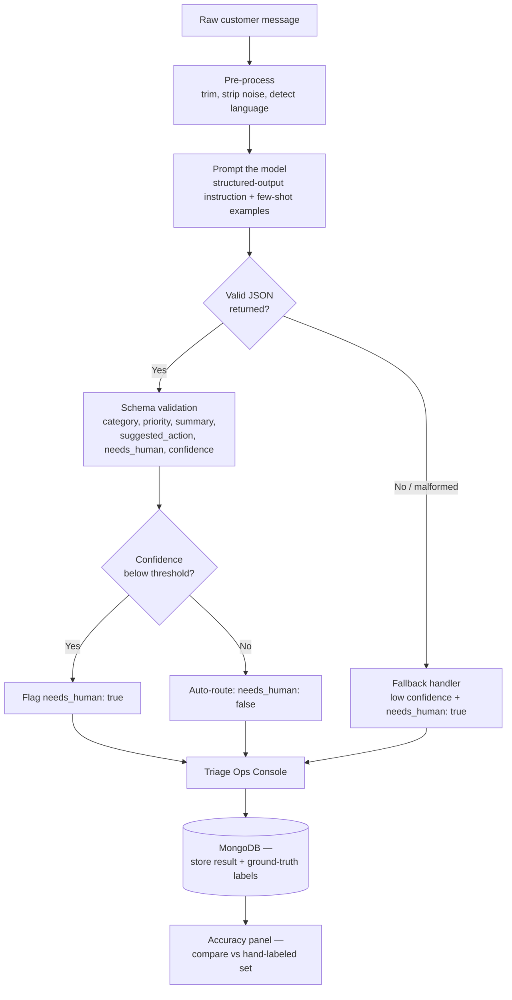

# FRONTLINE — AI Triage Engine

> Build AI software you'd actually trust to run on its own.

FRONTLINE reads raw, messy, unstructured customer messages — complaints, urgent outages, sarcastic one-liners, non-English text, multi-issue rants — and turns each one into a structured triage decision a support team can act on immediately, flagging the cases it isn't confident about instead of guessing.

This was built for the **Gateway Corp "One-Day AI Build Challenge"**: the brief is to turn an unstructured, sometimes-adversarial message pile into structured decisions software can act on, and to know — and show — when the system isn't sure.

---

## The problem

A fast-growing company's support inbox is one messy pile: clear bug reports next to sarcastic complaints next to a two-word greeting next to a message that bundles three unrelated issues together. A human has to read every single one before anything happens.

FRONTLINE automates that first read. For every incoming message, it decides:

- **What** is this about? (`category`)
- **How urgent** is it? (`priority`, P0–P3)
- **What's the one-line situation?** (`summary`)
- **What should happen next?** (`suggested_action`)
- **Can this be trusted to a human-less flow, or does a person need to look at it?** (`needs_human`)
- **How sure is the system?** (`confidence`)

The hard part isn't the happy path — it's the other 50%: sarcasm, non-English input, messages that bundle three complaints into one, or text that's just noise. FRONTLINE is built to survive those without crashing or confidently inventing an answer.

---

## How it works



**In words:**

1. **Input** — a raw message comes in, either typed into the single-message box or pulled from the 40-message dataset.
2. **Prompting** — the message is sent to the model with a structured-output instruction: respond only in the exact JSON schema, never invent facts not present in the message.
3. **Validation** — the response is checked against the expected schema. If it's missing a field, malformed, or the model call fails outright, the system doesn't crash — it falls back to a safe, explicitly low-confidence result and flags it for a human, rather than guessing.
4. **Confidence gate** — even a well-formed response gets checked against a confidence threshold. Below it, `needs_human` is set to `true` regardless of what the model claimed, because the brief's whole point is *knowing when you don't know*.
5. **Display** — results land on the Triage Ops Console as priority-lane cards (P0 = critical down the line to P3 = low), each showing its confidence as a signal-strength meter and whether it was auto-routed or kicked to a human.
6. **Evaluation** — a small hand-labeled ground-truth set is compared against the system's output to produce a real accuracy number, not a guess — this is what's shown in the one-page "AI Decisions" note.

---

## Tech stack

| Layer | Tech |
|---|---|
| Frontend | React (Vite), Tailwind CSS |
| Backend | Node.js, Express |
| Database | MongoDB (Atlas) |
| AI | Gemini API |

---

## Project structure

```
mern-starter/
├── backend/
│   ├── routes/
│   │   ├── authRoutes.js
│   │   └── triage.js          # triage endpoint — message in, structured decision out
│   ├── models/
│   ├── middleware/
│   ├── config/
│   └── server.js
└── frontend/
    └── src/
        ├── pages/
        │   ├── FrontlineDashboard.jsx   # Triage Ops Console
        │   ├── Home.jsx
        │   ├── Login.jsx
        │   └── Signup.jsx
        ├── components/
        ├── context/
        └── mockData.js         # sample/demo message set
```

---

## Output schema

Every processed message produces exactly this shape:

```json
{
  "category": "Payment Gateway / Outage",
  "priority": "P0",
  "summary": "Payment gateway down, checkout returning HTTP 500 for all customers.",
  "suggested_action": "Escalate to engineering + infra immediately; pull gateway logs.",
  "needs_human": true,
  "confidence": 0.95
}
```

- **`priority`** — `P0` (critical, e.g. outage/security) → `P3` (general query, no urgency)
- **`needs_human`** — `true` whenever confidence is low, the message is multi-issue, or the model call fails — never left to guesswork
- **`confidence`** — a 0–1 score the system reports honestly, including when it's near zero

---

## Reliability — how it handles the hard cases

| Case | Behavior |
|---|---|
| Garbage / unparseable input | Returns a valid low-confidence JSON, flagged for a human — never crashes |
| Vague or low-signal message (e.g. "hey whats up") | Low confidence, routed as low priority, not invented into something urgent |
| Multi-issue message | Flagged `multi-issue`; summary captures all parts rather than only the first |
| Sarcastic / angry tone | Flagged in metadata; priority driven by the actual issue, not the tone |
| Non-English / mixed-language input | Still processed; flagged so a human can sanity-check the translation |

---

## Running it locally

```bash
# backend
cd backend
npm install
npm run dev

# frontend (separate terminal)
cd frontend
npm install
npm run dev
```

Set your Gemini API key in `backend/.env` (see `.env.example`).

---

## What we'd improve with more time

- Expand the hand-labeled ground-truth set beyond the initial ~10 examples for a more robust accuracy measurement
- Add retry-with-backoff on model call failures before falling back to the low-confidence path
- Persist triage history in MongoDB for trend tracking across a full support queue, not just a single run
